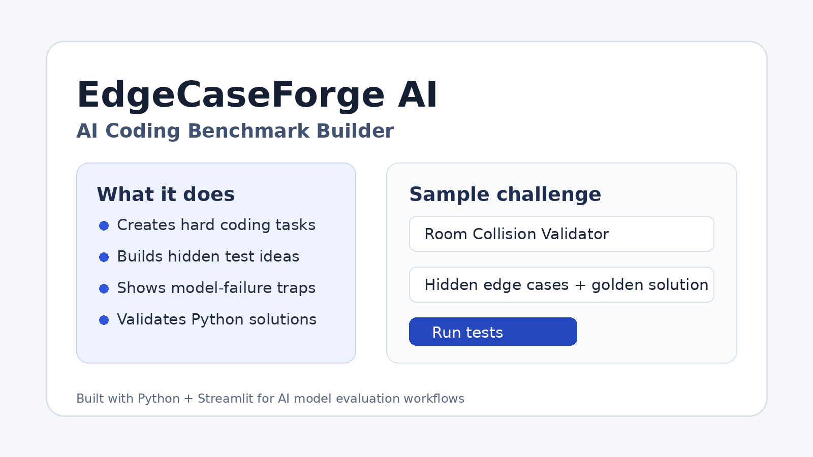

# EdgeCaseForge AI



**EdgeCaseForge AI** is a Python/Streamlit app for building coding-evaluation tasks for AI models. It helps generate problem statements, edge-case traps, hidden-test ideas, golden-solution hints, and sample validation for Python solutions.

This project was built as a portfolio project to demonstrate practical AI-evaluation, software engineering, and test-design skills.

---

## Why I Built This

AI coding models can often solve simple examples, but they still fail on edge cases, ambiguous requirements, hidden constraints, and tricky validation logic.

EdgeCaseForge AI focuses on the harder part of AI evaluation:

- designing coding tasks that test real reasoning
- identifying where models may fail
- creating hidden tests and edge cases
- validating sample solutions
- explaining the golden-solution strategy

---

## Features

- **Challenge library** with multiple coding task categories
- **AI failure analysis** for each problem
- **Hidden test-case ideas** for stronger evaluation
- **Golden-solution hints** for benchmark design
- **Python solution runner** for sample tests
- **Portfolio pitch generator** for explaining the project

---

## Tech Stack

- Python
- Streamlit
- JSON
- Subprocess-based local test runner

---

## Project Structure

```text
EdgeCaseForge-AI/
├── app.py
├── requirements.txt
├── README.md
├── DEMO_SCRIPT.md
├── LICENSE
├── .gitignore
├── data/
│   └── challenges.json
├── examples/
│   └── ledger_solution.py
└── assets/
    └── preview.png
```

---

## Getting Started

### 1. Clone the repository

```bash
git clone https://github.com/BeauDevCode/EdgeCaseForge-AI.git
cd EdgeCaseForge-AI
```

### 2. Install dependencies

```bash
pip install -r requirements.txt
```

### 3. Run the app

```bash
streamlit run app.py
```

---

## How It Works

1. Choose a coding challenge.
2. Read the problem statement and constraints.
3. Review the likely AI model failure points.
4. Study the hidden-test ideas.
5. Paste a Python solution using this format:

```python
def solve(input_data: str) -> str:
    return "your answer"
```

6. Run the sample tests.

---

## Example Challenge

**Room Collision Validator**

A 2D top-down game level contains rectangular walls. A player is represented as a circle. The task is to detect the first movement step where the player collides with a wall.

Why this is difficult for AI models:

- Many models only check whether the circle center is inside the rectangle.
- Correct collision requires circle-rectangle overlap logic.
- Reversed wall coordinates must be normalized.
- Touching edges should be handled carefully.

---

## Portfolio Description

> EdgeCaseForge AI is a Python/Streamlit app that helps design hard coding tasks for AI model evaluation. It creates problem statements, hidden test ideas, golden-solution hints, and model-failure explanations. I built it to show how AI coding models can be tested beyond simple examples, using edge cases and validation logic.

---

## What I Learned

Building this project helped me practice:

- designing better coding problems
- thinking like an AI evaluator
- writing clear test cases
- creating edge-case-driven validation
- building a clean Streamlit app
- structuring a GitHub portfolio project

---

## Future Improvements

- Add Docker sandboxing for safer code execution
- Add JavaScript and C++ solution runners
- Add downloadable challenge packages
- Add difficulty scoring based on edge-case coverage
- Add optional LLM-assisted challenge generation

---

## License

This project is licensed under the MIT License.
